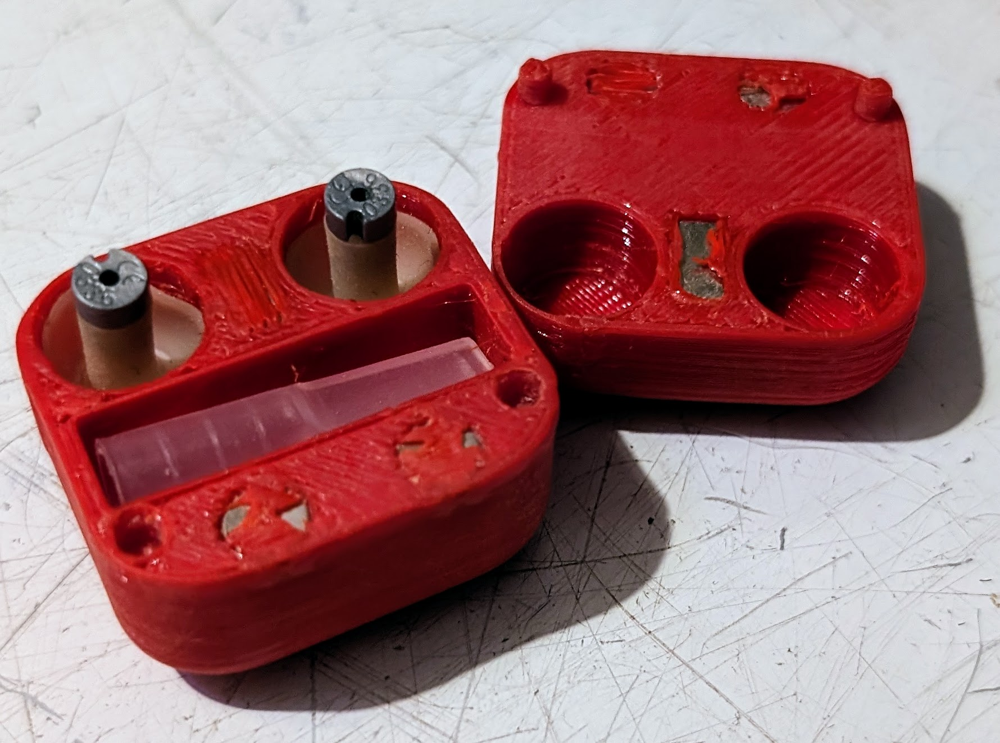
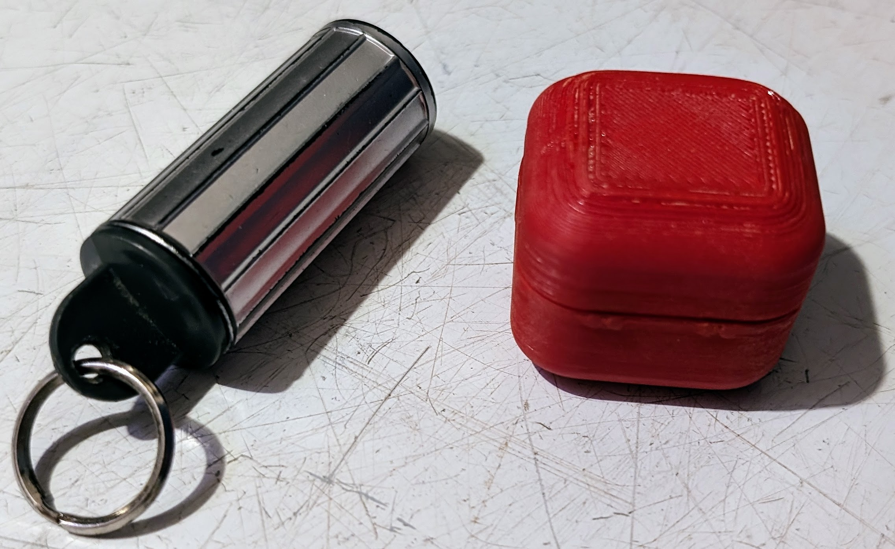

# Alpine Musicsafe case
Case for [Alpine Musicsafe](https://www.alpinehearingprotection.com/products/musicsafe) earplugs. These earplugs have a relatively flat frequency response and come with
multiple (mine had three) filters for different noise levels. The flat attenuation means you can enjoy music much more than standard safety earplugs. My tip is: put them
in before the band starts or you'll spend the gig remembering how good it sounded at first.

The earplugs themselves come with a little tube case that's a bit of a pain. The rubbery wings of the earplugs get stuck in there, along with the extraction tool for
getting them back out of your ears. You don't want to be dicking around at risk of dropping them on a crowded, dark dancefloor at a gig.

Magnets embedded in the case hold it together and alignment pins make it close properly. It's compact and sturdy, probably a more convenient shape to shove in your jeans
watch pocket than the original.

## Hardware needed
* 2x 8x5x2mm rectangular magnets
* 4x 6x2mm cylindrical magnets

## Printing
I printed in PETG because it's light and durable. Set up your print to pause when it reaches the layer just before it covers the holes. You'll need two pauses for the two sets
of magnets. Ctrl-click on layers in PrusaSlicer.

A drop of super glue inside the holes stops the magnets from springing out and attaching to the PINDA sensor or heatblock. I found this out through trial and error.

Post processing was scraping off rough bits, sanding edges especially the flat pieces so they mate together nicely, and
scraping out the alignment holes a bit because they were a bit tight.
